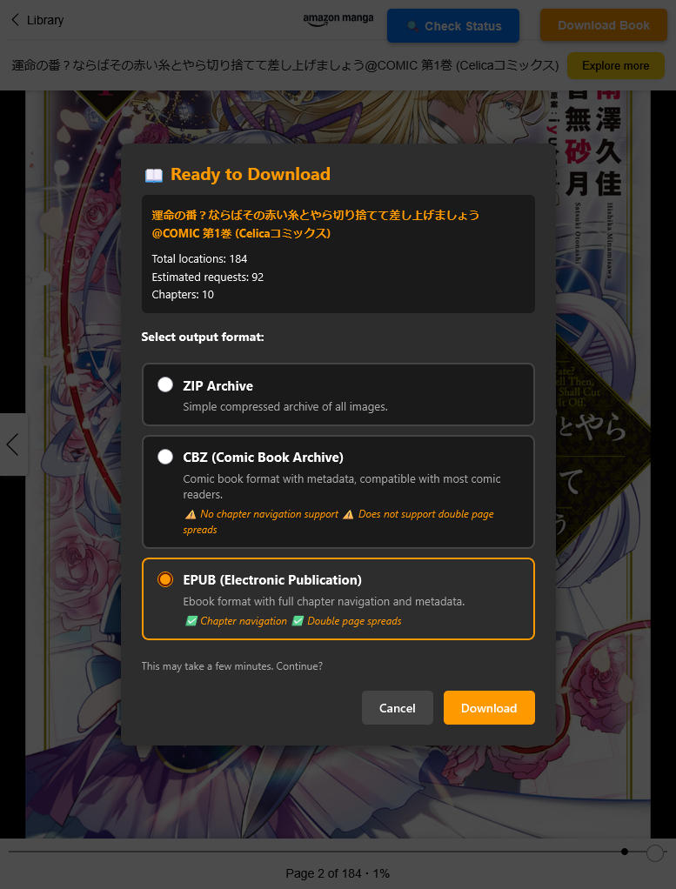

# Kindle Manga Downloader

A powerful Tampermonkey/Greasemonkey userscript that allows you to download manga images from your own Amazon Kindle library through the Kindle web interface(`read.amazon.co.jp/.com`).  This script extracts high-quality images from Kindle manga books and packages them into a convenient ZIP archive.

[](https://www.gnu.org/licenses/gpl-3.0)
[](https://github.com/Alexia/kindle-manga-downloader)

## Legal Notice

**This script is intended for personal, educational, and backup purposes only.**  You should only download manga that you have legally purchased or have the right to access.  This tool can only download content that you **legally own and does not remove DRM**.  Respect copyright laws and the rights of content creators.  The authors of this script are not responsible for any misuse.

## Features

- **One Click Downloads**: Simple download button added directly to the Kindle reader interface.
- **Automatic Decryption**: Images are decrypted automatically.
- **Progress Tracking**: Real-time progress modal with detailed status updates.
- **ZIP Packaging**: Automatically creates organized ZIP archives with properly named images.
- **High Quality**: Downloads original compression ratio images.
- **Multi-Region Support**: Works with both Amazon.co.jp and Amazon.com.
- **Chapter Detection**: Automatically parses table of contents and metadata.
- **Status Checker**: Built-in diagnostic tool to verify download readiness.



## Installation

### Prerequisites

1. A modern web browser (Firefox)
2. A userscript manager extension:
	- [Tampermonkey](https://www.tampermonkey.net/)
	- [Greasemonkey](https://www.greasespot.net/)
	- [Violentmonkey](https://violentmonkey.github.io/)

### Installation Steps

1. **Install a userscript manager**:
	- Click the link above for your preferred extension.
	- Follow the installation instructions for your browser.

2. **Install the script**:
	- Open the [the raw](https://raw.githubusercontent.com/Alexia/kindle-manga-downloader/refs/heads/master/kindle-manga-download.js) `kindle-manga-download.js` in your browser.
	- Your userscript manager should detect it and prompt you to install.
		- This might not work with some user script extensions and you might have to manually install it.
	- Click "Install" or "Confirm".

3. **Configure (Optional)**:
	- By default, debug mode is disabled, which only downloads the first few pages for testing.
	- To disable full downloads and test only a few test downloads at a time, edit the script and set:
	  ```javascript
	  const DEBUG_MODE = true;
	  ```

## Usage

1. **Open a manga** in your Kindle Cloud Reader:
	- Go to [read.amazon.com](https://read.amazon.com) or [read.amazon.co.jp](https://read.amazon.co.jp)
	- Open a manga from your library

2. **Check status** (optional):
	- Click the **"🔍 Check Status"** button in the top-right corner
	- Verify that all required data is available

3. **Download your manga**:
	- Click the **"📥 Download Manga"** button in the top-right corner
	- Review the download confirmation dialog showing:
		- Book title
		- Total number of pages
		- Estimated download time
	- Click **"Continue"** to start the download

4. **Monitor progress**:
	- A progress modal will display:
		- Page download progress
		- Image download progress
		- ZIP creation status
	- Wait for the download to complete (may take several minutes for large manga)

5. **Access your files**:
	- The ZIP file will be saved to your default downloads folder
	- Extract and enjoy your manga images!

## Technical Details

### How It Works

1. **Authentication & Setup**:
	- Extracts rendering token, ASIN, and revision information from the HTML.
	- Obtains decryption tokens from the API.

2. **Metadata Retrieval**:
	- Fetches Table of Contents (TOC) via Amazon's `/renderer/render` API.
	- Parses concatened TAR formatted responses containing JSON metadata.
	- Extracts location map for pagination.

3. **Page Downloads**:
	- Iterates through all page positions and collects page metadata on what images and page contents to collect.

4. **Image Processing**:
	- Constructs authenticated CDN Cloudfront URLs and downloads encrypted image data then decrypts them using AES-GCM with PBKDF2 key derivation,
	- Detects image format (PNG/JPEG/WebP) and creates the correctly named file.

5. **Archive Creation**:
	- Organizes images by page number then creates ZIP archive with zero compression (STORE mode) and finally triggers a browser download prompt.

### Encryption Details

Images are encrypted using:
- **Algorithm**: AES-GCM with 128-bit keys
- **Key Derivation**: PBKDF2 with 1,000 iterations
- **Hash Function**: SHA-256
- **Format**: Base64-encoded salt (24 chars) + IV (24 chars) + encrypted data

### Supported Domains

- `https://read.amazon.com/*`
- `https://read.amazon.co.jp/*`

### Dependencies

The script uses the following external libraries (loaded via CDN):

- [js-untar](https://github.com/InvokIT/js-untar) (v2.0.0) - TAR archive parsing
- [JSZip](https://stuk.github.io/jszip/) (v3.9.1) - ZIP archive creation

## Configuration

### Debug Mode

Debug mode allows testing without downloading entire books:

```javascript
const DEBUG_MODE = true;              // Enable/disable debug mode
const DEBUG_MAX_PAGE_REQUESTS = 3;    // Limit page requests
const DEBUG_MAX_IMAGES = 10;          // Limit image downloads
```

### Customization

You can modify various parameters in the script:

- **Viewport dimensions**: `width`, `height`, `dpi`
- **Font settings**: `fontFamily`, `fontSize`, `lineHeight`
- **Theme**: `dark` (current) or `light`
- **Request delay**: Adjust `setTimeout` value (default: 100ms)

## Troubleshooting

### "Could not find rendering token"
- Ensure that you are logged in and that the Kindle reader is fully loaded.
- Try refreshing the page and waiting a few seconds.
- If you're comfortable with debugging, open browser console (F12 in most browsers) and look for errors from this script.

### "Could not find book ASIN"
- Make sure you're on a book reading page and that the URL should start with `https://read.amazon.co.jp/manga/` or `https://read.amazon.com/manga/`
- Refresh the page

### "Decryption failed"
- The Karamel Renderer Token may have expired so please refresh the page.  The tokens are usually valid for five minute periods.
- If the book uses an unsupported encryption, please report this as an issue.

### Download stops prematurely
- Check browser console for errors
- Verify internet connection stability
- Note: The download sizes are about 75mbs in size for an entire manga volume.  Machines with limited RAM may have issues creating the ZIP archive in browser.

### Images appear corrupted
- Report the issue with book details and a screenshot demonstrating the issue.  I can't promise a fix if I don't have access to the book to test the issue though.

## Contributing

1. **Report bugs**: Open an issue with details about the problem
2. **Suggest features**: Share your ideas for improvements
3. **Submit pull requests**: Fix bugs or add features
4. **Improve documentation**: Help make the README clearer

AI assisted and developed contributions are okay, but they must be clearly labelled as such and they should follow the general coding style of the repository.

### Development Setup

1. Fork the repository
2. Make your changes to `kindle-manga-downloader.js`
3. Test thoroughly with debug mode first
4. Submit a pull request with a clear description

## Changelog

### Version 0.1.0 (Current)
- Initial release
- Support for Amazon.co.jp(Fully tested) and Amazon.com(Untested, should work)
- AES-GCM image decryption support
- Progress tracking UI (Jumbled broken mess)
- Preflight status checker tool
- Debug mode for testing

### Future Plans

- Extend chapter support.
- Fix the stupid compact/extract process for CBZ/EPUB.
- Option to create reader compatible formats instead of a ZIP archive.
- KFX/KPF Format - I don't know much about this, but it might be useful for Kindle users.
- Full book support instead of just manga images. (Rename project to Kindle-Web-Downloader?  Kindle-Karamel-Downloader?)

## License

This project is licensed under the GNU General Public License v3.0 - see the [LICENSE](LICENSE) file for details.

## Libraries and Acknowledgments

- [js-untar](https://github.com/InvokIT/js-untar) for TAR parsing
- [JSZip](https://stuk.github.io/jszip/) for ZIP creation

## Disclaimer

This software is provided "as is", without warranty of any kind.  The authors are not affiliated with Amazon or any of its subsidiaries.  This tool is for personal use only.  Please respect copyright laws and content creator rights.
